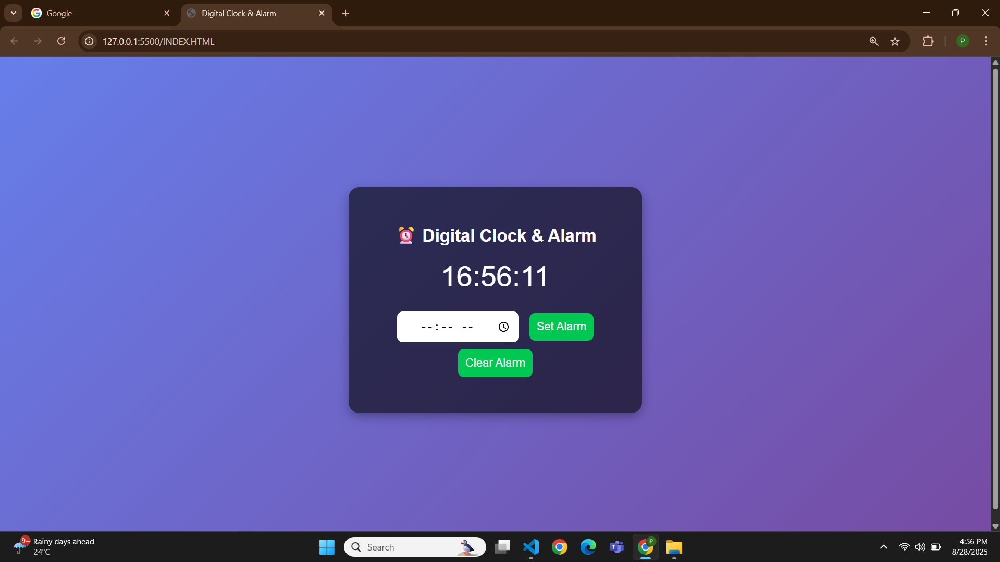

# ⏰ Digital Clock & Alarm

A simple **Digital Clock & Alarm Web App** built using **HTML, CSS, and JavaScript**.  
It shows the current time in real-time and allows users to set an alarm that rings at the specified time.  

---

## 🚀 Features
- Displays live **digital clock** (HH:MM:SS format)
- Set an **alarm time** with input field
- Plays alarm sound when time matches
- Clear alarm option
- Responsive and minimal design

---

## 📸 Screenshot

---

## 🎬 Demo Video

---

## 🛠️ Technologies Used
- **HTML5**  
- **CSS3**  
- **JavaScript**  

---

